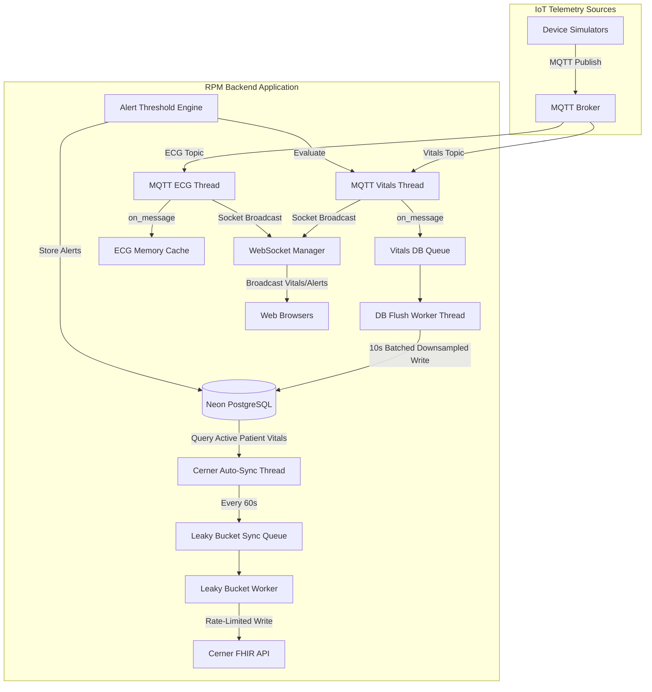

# Remote Patient Monitoring (RPM) Backend Documentation

This documentation provides an elaborate, in-depth guide to the entire backend architecture of the Remote Patient Monitoring (RPM) System (v2). It details every file, module, function, database model, integration flow, and design pattern used in the system, along with learning insights, highlighted code snippets, and analysis of reusability.

---

## 1. Architectural Overview & Design Patterns

The RPM backend is a high-performance, real-time telemetry ingestion and EHR integration system built with **FastAPI** and **Python 3**. It is designed to handle multiple concurrent tasks:
- **FastAPI HTTP & WebSocket Server**: Serves REST APIs and pushes real-time telemetry updates to frontend clients.
- **Dual MQTT Listeners**: Runs background threads to subscribe to public/private MQTT brokers for high-frequency vital signs and ECG data.
- **Leaky Bucket Background Queue**: Queues write operations to the Cerner EHR (FHIR API) to comply with rate limits and prevent socket exhaustion.
- **Database Flush Worker**: Downsamples and batches database writes in the background to minimize PostgreSQL connection overhead.
- **EHR Auto-Sync Scheduler**: Periodically polls active patients and queues their latest vitals to Cerner.

### System Architecture Flowchart


---

## 2. Directory Structure

The backend code is structured modularly:
```text
backend/
├── __init__.py
├── auth_dependency.py       # Authentication middleware (Cerner Token & Demo Token validation)
├── config.py                # Centralized configuration (CORS, MQTT, Cerner, Thresholds)
├── main.py                  # FastAPI Application startup and lifespan configuration
├── migrate_to_neon.py       # Database schema creation and migration script
├── requirements.txt         # Third-party library dependencies
├── database/
│   ├── __init__.py
│   ├── connection.py        # Neon PostgreSQL thread-local connection wrapper & auto-reconnect
│   └── models.py            # Normalized database schema definition
├── mqtt/
│   ├── __init__.py
│   └── listener.py          # Dual-threaded MQTT listener for vitals and ECG telemetry
├── routers/
│   ├── __init__.py
│   ├── auth.py              # SMART on FHIR config & OAuth token proxy endpoints
│   ├── beds.py              # Patient-bed assignment endpoints
│   ├── patients.py          # Patient CRUD, Cerner search, Custom thresholds & AI insights
│   ├── vitals.py            # Historical aggregated vitals & alert history query endpoints
│   └── websocket.py         # Real-time WebSocket connection router
├── services/
│   ├── __init__.py
│   ├── ai_service.py        # Clinical insight generator (Groq API / Llama 3)
│   ├── alert_service.py     # Threshold checking rules engine & alert storage
│   ├── bed_service.py       # Patient-bed lookup and active patient cache
│   ├── cerner_auto_sync.py  # Background worker for auto-syncing data to EHR
│   ├── cerner_queue.py      # Leaky bucket queue and background FHIR exporter
│   ├── system_token.py      # Client Credentials token manager for Cerner API
│   └── vitals_service.py    # Batched DB storage, downsampling & cache managers
└── telemetry/
    ├── exporters.py         # Custom OpenTelemetry JSON File exporters
    ├── logger.py            # Structured JSON logger with OTel trace correlation
    ├── metrics.py           # psutil system resource collector & OTel gauges
    ├── redaction.py         # Recursive PII/PHI data redaction engine
    └── setup.py             # OpenTelemetry auto-instrumentation setup
```

---

## 3. Detailed File & Module Documentation

### 3.1. Main Entrypoint & Configuration

#### `backend/main.py`
This is the application root that instantiates the FastAPI app and coordinates startup and shutdown using a lifespan manager.
- **`lifespan(app: FastAPI)`**: `asynccontextmanager` that performs:
  1. Database initialization via `init_db()`.
  2. Setting up the event loop and broadcasting callback for the MQTT listener.
  3. Starting the background MQTT subscriber threads (`start_mqtt_listener()`).
  4. Starting the automated Cerner FHIR sync worker if configured.
  5. During shutdown, stops MQTT loops, disconnects clients, and frees system resources.
- **Custom Swagger UI**: Injects a custom Swagger HTML handler at `/docs` using CDN resources (`https://unpkg.com/swagger-ui-dist@5/`) to ensure fast page loads and avoid internal asset dependencies.

#### `backend/config.py`
Stores and dynamically resolves environment variables.
- **`ALERT_THRESHOLDS`**: Defines system-wide default thresholds for:
  - `heart_rate`: (Warn: 55-110, Critical: 45-130)
  - `spo2`: (Warn Low: 94, Critical Low: 90)
  - `temperature` (F): (Warn High: 99.5, Critical High: 101.3)
  - `respiratory_rate`: (Warn: 10-22, Critical: 8-28)
  - `systolic_bp`: (Warn: 95-140, Critical: 80-170)
  - `diastolic_bp`: (Warn: 55-90, Critical: 45-100)
- **`MQTT_SESSION_ID`**: Unique prefix used to isolate topics on shared brokers (avoiding cross-talk during developer deployments).

---

### 3.2. Database Layer (`backend/database/`)

#### `backend/database/models.py`
Contains the raw SQL schema string (`SCHEMA_SQL`) used to spin up the database. The system uses a normalized PostgreSQL relational design:
1. **`patients`**: Stores patient metadata. The primary key `id` stores the Cerner Patient ID directly.
2. **`vitals`**: Time-series store of telemetry data points (`heart_rate`, `spo2`, `temperature`, `respiratory_rate`, `systolic_bp`, `diastolic_bp`). Has a composite index `idx_vitals_patient_time` on `(patient_id, recorded_at DESC)` for fast queries.
3. **`alerts`**: Logs triggered events, severity, and acknowledgement state. Supported by index `idx_alerts_patient`.
4. **`patient_thresholds`**: Custom overrides for vital ranges per patient.
5. **`patient_beds`**: Allocates beds (`bed_id`) to active patients.

#### `backend/database/connection.py`
Implements a resilient thread-local database connection layer for Neon PostgreSQL.
- **`CursorWrapper`**: Translates database queries to return native Python dictionaries instead of raw tuples.
- **`ConnectionWrapper`**: Wraps `psycopg2` connections. It intercept SQL placeholders (`?` changed to `%s` for PG compatibility) and implements retry/recovery logic on `psycopg2.OperationalError` or `psycopg2.InterfaceError` (common in serverless Neon connections after periods of inactivity).
- **`get_connection()`**: Retrieves a thread-safe connection instance bound to the active thread via `threading.local()`.
- **`init_db()`**: Creates missing tables. Performs automated schema upgrades (detects and handles migrations from sqlite schemas) and purges telemetry data older than 7 days to manage storage footprint.

---

### 3.3. Telemetry & Observability (`backend/telemetry/`)

The system implements strict clinical grade auditing, PII redaction, and tracing.

#### `backend/telemetry/redaction.py`
The redaction engine checks dictionary keys and text values for PII and PHI.
- **`SENSITIVE_KEYS`**: Set containing keys like `patient_id`, `name`, `email`, `phone`, `ssn`, `dob`, `address`.
- **`partially_redact(text)`**: Masks all but the last 4 characters of a string.
- **`redact_string(text)`**: Applies regular expressions to replace phone numbers and email usernames.
- **`redact_dict(data)`**: Recursively traverses nested dictionaries/lists to scrub sensitive information before logging or exporting traces.

#### `backend/telemetry/logger.py`
A structured JSON logger yielding output format perfectly suited for Loki ingestion.
- **`RedactedJsonFormatter`**: A logging formatter that injects system info (`module`, `funcName`, `lineNo`), captures trace/span IDs from the active OpenTelemetry context, and formats output as raw JSON strings.
- **`log_event(logger, level, message, **attrs)`**: Standardized function to log structured events. Sensitive arguments like `patient_id` are automatically hashed or partially redacted (`patient_id_hash`), preventing trace files from storing plaintext identifiers.
- **`Timer`**: Context manager to record operational latencies in milliseconds.

#### `backend/telemetry/metrics.py`
Monitors system resources.
- **`ProcessMetricsCollector`**: Spawns a daemon thread (`ProcessMetricsSampler`) that samples process memory RSS and CPU utilization using `psutil` every 15 seconds. It exposes these readings to OpenTelemetry gauges:
  - `rpm.process.cpu_percent`
  - `rpm.process.memory_rss_mb`

#### `backend/telemetry/exporters.py`
Exporters to output OpenTelemetry data to the local file system.
- **`JsonFileSpanExporter`**: Writes redacted trace spans to `traces.json`.
- **`JsonFileMetricExporter`**: Writes redacted metrics to `metrics.json`.

#### `backend/telemetry/setup.py`
Configures the global OpenTelemetry SDK. Sets up FastAPI middleware auto-instrumentation, binds standard library logs, and hooks outgoing HTTP calls made by `httpx` or `requests` libraries.

---

### 3.4. SMART on FHIR & Cerner Integration

#### `backend/services/system_token.py`
Retrieves a system-level client credentials token for background tasks.
- **`get_system_token()`**: Encodes the system credentials into a Basic Authorization header and fetches a token from `CERNER_TOKEN_URL`. It caches this token and refreshes it 30 seconds before expiry.

#### `backend/services/cerner_queue.py`
A **leaky bucket queue** that queues vital signs to Cerner. Because FHIR writes involve roundtrips to external EHR environments, performing writes synchronously within the WebSocket receiver would block the network thread. 
- **`enqueue_vitals(patient_id, cerner_patient_id, vitals)`**: Converts vital fields (`heart_rate`, `spo2`, etc.) to FHIR Observation resources, map them to LOINC codes, and adds them to `_sync_queue`. Blood pressure measurements are grouped into a panel (LOINC: `85354-9`) containing systolic and diastolic components.
- **`_worker_loop()`**: A background worker daemon. It consumes observations from the queue and sends POST requests to Cerner's `/Observation` endpoint.
- **Rate-Limiting (Leak Rate)**: Implements `time.sleep(2.0)` between requests to respect external rate limits.
- **Robust Retry Logic**: If a write fails (non-2xx code) or throws an exception:
  1. The event is logged, and the item's `retry_count` is incremented.
  2. The worker sleeps for 5 seconds before retrying.
  3. If it fails 3 times, the item is moved back to the tail of the queue to prevent head-of-line blocking.

#### `backend/services/cerner_auto_sync.py`
Runs a background scheduler (`sync_worker`) that wakes up every 60 seconds:
1. Queries all active patients.
2. Checks their latest vital sign recording time.
3. If they have active data (recorded within the last 5 minutes), it queues them for Cerner write using `enqueue_vitals()`.
4. Stale patients (>5 minutes without telemetry) are skipped to prevent outbound payload bloat.

---

### 3.5. Real-Time Telemetry Streaming (`backend/mqtt/` & `backend/routers/websocket.py`)

#### `backend/mqtt/listener.py`
Spawns two separate subscriber client threads: `MQTT-Vitals-Thread` and `MQTT-ECG-Thread`. This partition prevents high-frequency ECG streaming (typically 50-250 Hz) from saturating the queue processing required for vital signs and alerts.
- **`_on_message(client, userdata, msg)`**:
  - Parses topic structures: `rpm/{session_id}/{patient_id}/{type}`.
  - Verifies that the patient is assigned to an active bed via `get_active_patient_ids()`. Telemetry for unassigned patients is immediately dropped at the ingress point.
  - **ECG Telemetry**: Broadcasts to WebSockets and appends to an in-memory buffer (`store_ecg()`) capped at 500 samples to prevent memory leaks.
  - **Vitals Telemetry**: Queues data points in memory (`store_vitals()`), triggers the alert rule checker (`check_vitals()`), broadcasts the values, and issues separate WS frames for any generated alerts.

#### `backend/routers/websocket.py`
Manages active WebSocket connections.
- **`connected_clients`**: Set storing active socket objects.
- **`broadcast(data)`**: Iterates over connections, pushing JSON payloads. Dead sockets are collected and removed from the active set to prevent memory leaks.
- **`websocket_endpoint(ws)`**: Accepts connections, pushes the initial system snapshot (latest patient vitals), and maintains a keep-alive read loop.

---

### 3.6. Business Services

#### `backend/services/alert_service.py`
Compares vital signs against ranges and saves alerts.
- **`check_vitals(data)`**: Validates fields against custom bounds (fetched from database via `get_custom_thresholds()`) or defaults.
- It checks critical ranges before warning ranges. If a value breaches a threshold, it inserts a record into the database, updates OpenTelemetry event logs, and returns the alert.

#### `backend/services/vitals_service.py`
Core business logic for patient CRUD, historical queries, and cache management.
- **DB Write Congestion Control**: Spawns a background thread (`db_flush_worker`) that flushes vitals to PostgreSQL every 10 seconds.
- **`flush_vitals_to_db()`**: Drains the queue. If multiple data points exist for a patient within the 10-second block, it discards older entries and persists only the latest reading (downsampling). This prevents write-heavy database locks.
- **Cache Merging**: Methods like `get_all_patients()` and `get_patient()` read historical data from the database and overlay the most recent cached vital signs in memory.

#### `backend/services/ai_service.py`
Generates clinical summaries using Llama 3 on Groq.
- **`generate_clinical_insight(patient_data, vitals, alerts)`**:
  - Summarizes recent trends by bucketizing 60 minutes of vitals into 10-minute intervals (calculating mean, min, and max).
  - Merges these trends with the last 5 raw readings and recent alerts.
  - Directs Llama 3 to output status assessments, clinical reasoning, concerns, and recommended next steps using Markdown.

---

### 3.7. REST Routers (`backend/routers/`)

- **`routers/auth.py`**:
  - `/api/auth/config`: Returns configurations so frontends can construct SMART launch URLs.
  - `/api/auth/token` & `/api/auth/refresh`: Proxy endpoints that handle code exchange and token refreshing. This centralizes OAuth credentials and avoids CORS restrictions.
- **`routers/patients.py`**:
  - `/cerner/search`: Queries the Cerner FHIR sandbox using the system token. It concurrently queries the active encounter status for each result.
  - `/cerner/{id}`: Retrieves demographics and parses telecom, address, and encounter histories.
  - `/api/patients/{id}/insights`: Validates that a patient has at least 10 minutes of active telemetry before invoking the clinical insight generator.
- **`routers/beds.py`**: Handlers to query, assign, or delete patient-bed links.
- **`routers/vitals.py`**:
  - `/history`: Retrieves aggregated 1-minute historical averages for a specific hour (uses Postgres `to_char` group-by aggregations).
  - `/vitals`: Retrieves raw history for custom charts.

---

## 4. Learning Insights & Key Technical Highlights

Developing this system yielded several major insights regarding Python concurrency, database operations, and external EHR integrations.

### 4.1. Concurrency: Interfacing Async FastAPI with Sync Background Threads

**Problem**: FastAPI is built on Python's `asyncio` loop, while standard libraries like `paho-mqtt` and database operations run synchronously in dedicated background threads. Bridging these two models safely is critical to prevent thread blocks and event loop crashes.

**Solution**:
1. We capture the running event loop on startup.
2. In background thread callbacks (like `on_message` in MQTT), we use `asyncio.run_coroutine_threadsafe()` to schedule the broadcast tasks back onto the main event loop.

#### 💡 Code Highlight: Async-to-Sync Bridge
```python
# file:///d:/rpm-system-v2/backend/mqtt/listener.py#L119-L121
if _broadcast_fn and _event_loop:
    # Safely schedule a coroutine to run on the main FastAPI event loop from a background thread
    asyncio.run_coroutine_threadsafe(_broadcast_fn(ws_message), _event_loop)
```

**Reusability**: This pattern is highly reusable in any system where data enters via background workers (e.g., Celery, Kafka consumers, serial port readers) and needs to be broadcast through async WebSockets.

---

### 4.2. Database Congestion Control: In-Memory Queues & Batch Downsampling

**Problem**: Pushing high-frequency IoT telemetry directly to a database causes lock contention and transaction limits, particularly with serverless database providers like Neon.

**Solution**:
Instead of writing each incoming packet to the database, vitals are cached in memory for real-time reads and queued. A background worker drains this queue every 10 seconds, downsamples the records, and performs a batched insert.

#### 💡 Code Highlight: Batched Database Downsampling
```python
# file:///d:/rpm-system-v2/backend/services/vitals_service.py#L149-L168
def flush_vitals_to_db():
    """Drain the queue and perform batched database write."""
    items = []
    while not vitals_queue.empty():
        try:
            items.append(vitals_queue.get_nowait())
        except queue.Empty:
            break

    if not items:
        return

    # Congestion control: Keep only the latest vital reading for each patient in this batch
    latest_per_patient = {}
    for data in items:
        pid = data["patient_id"]
        latest_per_patient[pid] = data

    downsampled_items = list(latest_per_patient.values())
    
    # Write downsampled_items to database...
```

**Reusability**: This downsampling queue can be applied to metrics collection, server log ingestion, or IoT sensor networks to protect backend databases from transaction overload.

---

### 4.3. Resilient Integration: The Leaky Bucket Queue Pattern

**Problem**: External API endpoints (like Cerner FHIR) are slow and enforce rate limits. Triggering synchronous HTTP requests on every telemetry update can trigger rate limit blocks and connection pool exhaustion.

**Solution**:
1. Implement a thread-safe Queue (`_sync_queue`).
2. Enqueue separate Observation structures for each vital type.
3. Use a persistent background thread (`_worker_loop`) to process items one by one.
4. Enforce a leak rate (e.g., `2.0 seconds` delay) between requests.
5. Apply backoff policies that return failed items to the tail of the queue.

#### 💡 Code Highlight: Leaky Bucket Worker
```python
# file:///d:/rpm-system-v2/backend/services/cerner_queue.py#L200-L224
while True:
    try:
        # Block until an item is available
        item = _sync_queue.get()
        if item is None:
            break

        _process_queue_item_with_retry(item)
        _sync_queue.task_done()

        # Leak delay to prevent rate limit congestion
        time.sleep(_leak_rate_seconds)

    except Exception as loop_err:
        log_event(
            logger, logging.ERROR,
            "Cerner leaky-bucket worker unhandled loop error",
            event_category="cerner_write",
            event_type="fhir_observation_failure",
            outcome="failure",
            error_detail=str(loop_err),
        )
        time.sleep(5.0)
```

**Reusability**: Essential for any application integrating with third-party webhooks, notification SMS gateways, or transactional mail servers.

---

### 4.4. OpenTelemetry: PHI/PII-Safe Auditing

**Problem**: Health applications are subject to strict regulations (e.g., HIPAA). Centralized trace logs (tempo, loki) must not store plain-text patient names, emails, phone numbers, or patient IDs.

**Solution**:
We integrate a recursive redaction engine into the OpenTelemetry span processing pipeline.

#### 💡 Code Highlight: Recursive PII Redaction
```python
# file:///d:/rpm-system-v2/backend/telemetry/redaction.py#L36-L57
def redact_dict(data: dict) -> dict:
    """Recursively redact sensitive keys and string values in a dictionary."""
    redacted = {}
    for k, v in data.items():
        if any(sensitive_key in k.lower() for sensitive_key in SENSITIVE_KEYS):
            # Partially redact the value if it's string/int-like, else fully redact
            if isinstance(v, (str, int)):
                redacted[k] = partially_redact(v)
            else:
                redacted[k] = '[REDACTED]'
        elif isinstance(v, dict):
            redacted[k] = redact_dict(v)
        elif isinstance(v, list):
            redacted[k] = [
                redact_dict(item) if isinstance(item, dict) else (redact_string(str(item)) if isinstance(item, str) else item) 
                for item in v
            ]
        elif isinstance(v, str):
            redacted[k] = redact_string(v)
        else:
            redacted[k] = v
    return redacted
```

**Reusability**: Can be imported directly into Python gateways or middleware filters (FastAPI, Flask, Django) to comply with data privacy regulations.

---

### 4.5. Groq Clinical Insight Generation

**Problem**: Large Language Models require structured, concise context. Providing raw, high-frequency JSON time-series data consumes excessive tokens, leads to model confusion, and raises token costs.

**Solution**:
Vitals are aggregated into 10-minute buckets over a 60-minute window, calculating mean, min, and max ranges. This data, combined with recent alerts, is sent to the LLM with structured medical prompts.

#### 💡 Code Highlight: Bucketized LLM Prompt Construction
```python
# file:///d:/rpm-system-v2/backend/services/ai_service.py#L60-L88
trend_lines = []
for start_dt, end_dt, b_vitals in buckets:
    def get_stats(key):
        vals = [v[key] for v in b_vitals if v.get(key) is not None]
        if not vals:
            return "N/A"
        if all(isinstance(x, int) for x in vals) or key in (
            "heart_rate", "spo2", "respiratory_rate", "systolic_bp", "diastolic_bp"
        ):
            return f"{int(statistics.mean(vals))} ({int(min(vals))}-{int(max(vals))})"
        return f"{statistics.mean(vals):.1f} ({min(vals):.1f}-{max(vals):.1f})"

    hr = get_stats("heart_rate")
    spo2 = get_stats("spo2")
    rr = get_stats("respiratory_rate")
    sys = get_stats("systolic_bp")
    dia = get_stats("diastolic_bp")

    time_label = f"[{start_dt.strftime('%H:%M')}-{end_dt.strftime('%H:%M')}]"
    trend_lines.append(
        f"{time_label} HR: {hr} | SpO2: {spo2} | RR: {rr} | BP: {sys}/{dia}"
    )
```

**Reusability**: This pattern of downsampling and consolidating data trends before submitting queries is highly recommended for time-series analytics, financial charts, and operational dashboards integrated with LLMs.
