# Remote Patient Monitoring (RPM) System — Project Documentation

> **Version:** 1.0.0 · **Last Updated:** July 2026
> **Authors:** Rohith Sajeev, Aaryan Nampoothiri, Dipika K

---

## Table of Contents

- [1. Project Overview](#1-project-overview)
- [2. Project Architecture](#2-project-architecture)
- [3. Technology Stack](#3-technology-stack)
- [4. Project Folder Structure](#4-project-folder-structure)
- [5. Backend Documentation](#5-backend-documentation)
- [6. Database Documentation](#6-database-documentation)
- [7. Frontend Documentation](#7-frontend-documentation)
- [8. Configuration Files](#8-configuration-files)
- [9. Authentication](#9-authentication)
- [10. API Communication](#10-api-communication)
- [11. Installation Guide](#11-installation-guide)
- [12. Deployment Guide](#12-deployment-guide)
- [13. Security](#13-security)
- [14. Code Explanation](#14-code-explanation)
- [15. Project Workflow](#15-project-workflow)
- [16. Sequence Diagrams](#16-sequence-diagrams)
- [17. Flowcharts](#17-flowcharts)
- [18. Error Handling](#18-error-handling)
- [19. Performance Analysis](#19-performance-analysis)
- [20. Testing](#20-testing)
- [21. Future Enhancements](#21-future-enhancements)
- [22. Project Summary](#22-project-summary)

---

## 1. Project Overview

### Project Title

**Remote Patient Monitoring (RPM) System** — An ICU-grade, real-time vital signs monitoring platform with Cerner EHR (FHIR R4) integration.

### Problem Statement

In modern healthcare, patients in Intensive Care Units (ICUs) produce a continuous stream of vital signs data from bedside devices. Clinical staff need an integrated system that:

1. Ingests real-time telemetry (heart rate, SpO₂, temperature, respiratory rate, blood pressure, ECG) from IoT devices.
2. Persists time-series vitals data for historical analysis and trend detection.
3. Generates threshold-based clinical alerts (warning/critical) in real time.
4. Provides AI-powered clinical insights to assist remote physicians.
5. Synchronizes captured vitals back to the hospital's Electronic Health Record (EHR) system — specifically the **Cerner Millennium EHR** via its FHIR R4 API.

No off-the-shelf solution exists that combines IoT ingestion, real-time WebSocket streaming, AI insights, and bidirectional FHIR R4 EHR synchronization in a single, deployable, open-source platform.

### Purpose of the Project

To build a full-stack, production-oriented Remote Patient Monitoring system that acts as a **bridge between bedside IoT medical devices and the Cerner EHR**, providing clinicians with a modern real-time dashboard while maintaining EHR data integrity.

### Objectives

1. Ingest vital signs from IoT medical devices via MQTT protocol in real time.
2. Store and index time-series vitals in a cloud-hosted PostgreSQL database (NeonDB).
3. Stream live vitals and alerts to a browser-based dashboard via WebSockets.
4. Implement configurable, per-patient alert thresholds (warning & critical).
5. Authenticate clinical users via SMART on FHIR (OAuth2) against the Cerner EHR Sandbox.
6. Write vital signs observations back to the Cerner FHIR R4 server using LOINC-coded resources.
7. Generate AI-powered clinical insights (via Groq/Llama 3) based on vitals trends and alerts.
8. Implement enterprise-grade observability with OpenTelemetry traces, metrics, and structured JSON logs exportable to a Grafana stack.

### Key Features

| # | Feature | Description |
|---|---------|-------------|
| 1 | **Real-Time Vitals Dashboard** | WebSocket-driven ICU floor view showing live HR, SpO₂, Temp, RR, BP per bed |
| 2 | **ECG Waveform Rendering** | In-memory ECG buffer with real-time canvas waveform rendering |
| 3 | **MQTT IoT Ingestion** | Dual MQTT clients (vitals + ECG) subscribing to HiveMQ Cloud broker |
| 4 | **Threshold-Based Alerts** | Per-patient configurable warning/critical thresholds with real-time broadcast |
| 5 | **SMART on FHIR Auth** | Full OAuth2 Authorization Code flow with Cerner EHR Sandbox |
| 6 | **Bidirectional FHIR Sync** | Read patient demographics & write FHIR Observations (LOINC-coded) to Cerner |
| 7 | **Leaky Bucket Queue** | Rate-limited background queue for Cerner FHIR writes (2s leak rate) |
| 8 | **AI Clinical Insights** | Groq-powered (Llama 3.3 70B) medical AI analysis per patient |
| 9 | **Bed Management** | ICU bed → patient mapping with drag-and-assign workflow |
| 10 | **Historical Vitals** | Hourly aggregated and raw time-series vitals charting with Recharts |
| 11 | **OpenTelemetry Observability** | Traces, metrics, and structured JSON logs with Grafana/Loki/Tempo integration |
| 12 | **PII Redaction** | Automatic PII redaction in logs (patient IDs, emails, phone numbers) |
| 13 | **Demo/Offline Mode** | Full functionality without Cerner EHR using mock token authentication |

### Scope

- **In Scope:** Real-time monitoring, FHIR R4 integration, alert engine, AI insights, observability, authentication, bed management, historical charting.
- **Out of Scope:** Physical IoT device firmware, clinical decision support (CDS) hooks, HL7v2 integration, multi-tenant SaaS deployment, mobile applications.

### Expected Outcomes

1. A fully functional RPM dashboard deployable for ICU monitoring demonstrations.
2. Successful bidirectional data flow with the Cerner EHR Sandbox (FHIR R4).
3. Sub-second latency from IoT device → dashboard display via MQTT → WebSocket bridge.
4. Full observability pipeline exportable to Grafana Cloud or self-hosted Grafana stack.

---

## 2. Project Architecture

### High-Level Architecture Diagram

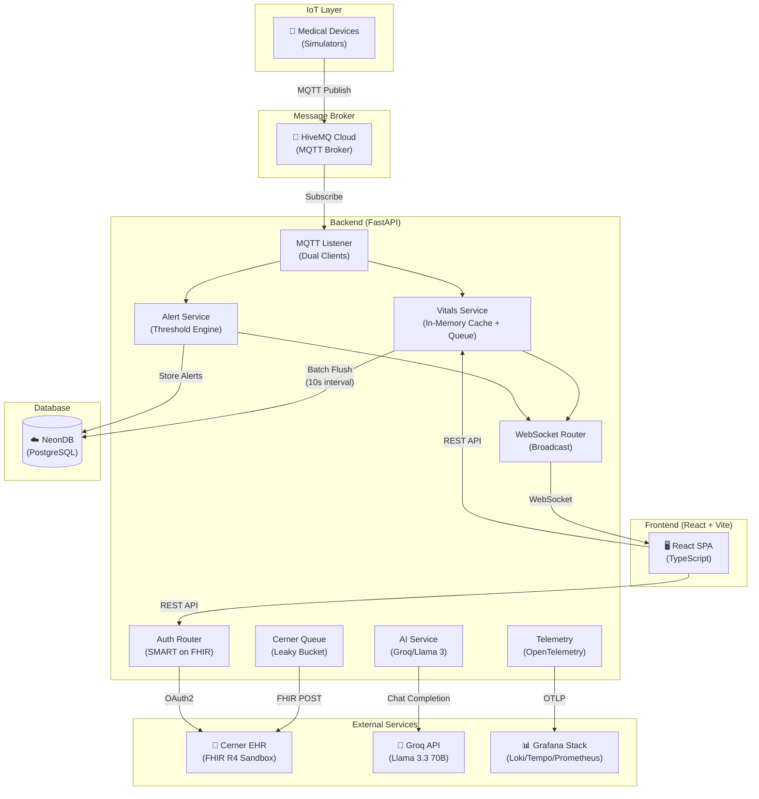

### Client-Server Architecture

The system follows a **three-tier architecture**:

1. **Presentation Tier (Frontend):** React SPA served by Vite dev server, communicating via REST API and WebSocket.
2. **Application Tier (Backend):** FastAPI application handling business logic, MQTT ingestion, FHIR integration, and alert processing.
3. **Data Tier (Database):** NeonDB (serverless PostgreSQL) for persistent storage; in-memory caches for real-time data.

### Data Flow

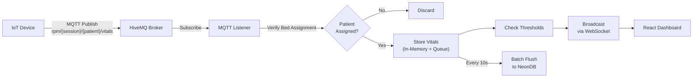

### API Flow

All REST API endpoints are served under the `/api` prefix. The frontend communicates with the backend via:
- **REST API** (HTTP) — for CRUD operations, configuration, and data retrieval.
- **WebSocket** (`/ws`) — for real-time vitals, alerts, and ECG streaming.

### Authentication Flow

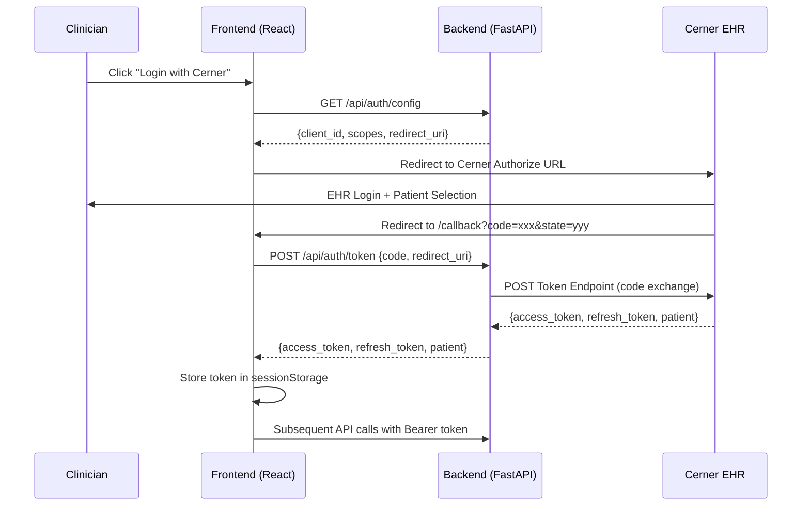

---

## 3. Technology Stack

| Category | Technology | Version | Purpose |
|----------|-----------|---------|---------|
| **Backend Framework** | FastAPI | ≥0.115.0 | High-performance async Python web framework for building RESTful APIs |
| **ASGI Server** | Uvicorn | ≥0.30.0 | Lightning-fast ASGI server to run the FastAPI application |
| **Frontend Framework** | React | 19.2.6 | Component-based UI library for building the interactive dashboard |
| **Build Tool** | Vite | 8.0.12 | Next-generation frontend build tool with HMR for rapid development |
| **Language (Frontend)** | TypeScript | ~6.0.2 | Type-safe JavaScript for improved developer experience and reliability |
| **Language (Backend)** | Python | 3.11+ | Primary backend language for API, MQTT, and business logic |
| **Database** | NeonDB (PostgreSQL) | Serverless | Cloud-hosted serverless PostgreSQL for persistent data storage |
| **Message Broker** | HiveMQ Cloud (MQTT) | 5.x | Enterprise MQTT broker for real-time IoT telemetry ingestion |
| **MQTT Client** | Paho MQTT | ≥2.1.0 | Python MQTT client for subscribing to device telemetry topics |
| **HTTP Client** | httpx | ≥0.27.0 | Async HTTP client for Cerner FHIR API calls and OAuth2 flows |
| **DB Adapter** | psycopg2-binary | ≥2.9.12 | PostgreSQL adapter for Python |
| **State Management** | Zustand | 5.0.14 | Lightweight, hook-based state management for React |
| **Charting** | Recharts | 3.8.1 | Composable charting library for rendering vitals time-series |
| **Animations** | Framer Motion | 12.40.0 | Production-ready animation library for React UI transitions |
| **Markdown Rendering** | react-markdown | 10.1.0 | Renders AI-generated clinical insights in markdown format |
| **Routing** | React Router DOM | 7.18.0 | Declarative routing for the React SPA |
| **AI / LLM** | Groq (Llama 3.3 70B) | API | Ultra-fast LLM inference API for generating clinical insights |
| **Authentication** | SMART on FHIR (OAuth2) | R4 | Industry-standard healthcare authentication protocol |
| **EHR Integration** | Cerner FHIR R4 | Sandbox | Bidirectional patient data exchange via HL7 FHIR standard |
| **Observability** | OpenTelemetry | SDK | Vendor-neutral telemetry framework for traces, metrics, and logs |
| **Monitoring** | Grafana + Loki + Tempo + Prometheus | Stack | Full observability stack for dashboards, log aggregation, and tracing |
| **Env Management** | python-dotenv | ≥1.0.0 | Loads environment variables from `.env` files |
| **Process Metrics** | psutil | ≥5.9.0 | System-level CPU and memory monitoring |
| **Deployment (Frontend)** | Vercel | — | Serverless frontend deployment platform |
| **Package Manager** | npm / pip | — | JavaScript and Python dependency management |

---

## 4. Project Folder Structure

```
rpm-system-v2/
|-- .env.example                    # Template for environment variables (never commit .env)
|-- .gitignore                      # Git ignore rules for Python, Node, env, logs
|-- README.md                       # Project README
|-- start1.bat                      # Windows batch script to launch backend + frontend simultaneously
|
|-- backend/                        # -- Python FastAPI Backend ----------------------
|   |-- __init__.py                 # Package initializer
|   |-- main.py                     # FastAPI entry point, lifespan management, CORS, router registration
|   |-- config.py                   # Centralized configuration (MQTT, DB, alerts, CORS, Cerner, app settings)
|   |-- auth_dependency.py          # Authentication dependencies (require_auth, require_cerner_auth)
|   |-- requirements.txt            # Python dependencies with inline documentation
|   |-- migrate_to_neon.py          # One-time migration script: SQLite → NeonDB PostgreSQL
|   |-- .env.example                # Backend-specific env template
|   |
|   |-- database/                   # -- Database Layer ------------------------------
|   |   |-- __init__.py
|   |   |-- connection.py           # Thread-local PostgreSQL connection pool with auto-reconnect
|   |   \-- models.py              # SQL schema definitions (patients, vitals, alerts, thresholds, beds)
|   |
|   |-- routers/                    # -- API Routers (Controller Layer) --------------
|   |   |-- __init__.py
|   |   |-- auth.py                 # SMART on FHIR config, OAuth2 token exchange & refresh proxy
|   |   |-- patients.py             # Patient CRUD, Cerner search/import, thresholds, AI insights, FHIR sync
|   |   |-- vitals.py               # Vitals history, hourly aggregation, alerts retrieval
|   |   |-- beds.py                 # Bed assignment/unassignment endpoints
|   |   \-- websocket.py            # WebSocket endpoint for real-time vitals broadcasting
|   |
|   |-- services/                   # -- Business Logic (Service Layer) --------------
|   |   |-- __init__.py
|   |   |-- vitals_service.py       # Vitals storage, in-memory caching, batched DB flush, patient CRUD
|   |   |-- alert_service.py        # Threshold evaluation engine, alert persistence & retrieval
|   |   |-- bed_service.py          # Bed ↔ patient mapping with cached active patient lookups
|   |   |-- ai_service.py           # Groq/Llama 3 clinical insight generation
|   |   |-- cerner_queue.py         # Leaky bucket queue for rate-limited FHIR Observation writes
|   |   |-- cerner_auto_sync.py     # Background thread: automatic 60-second Cerner sync cycle
|   |   \-- system_token.py         # Client credentials OAuth2 flow for system-level Cerner access
|   |
|   |-- mqtt/                       # -- MQTT IoT Ingestion Layer ------------------─
|   |   |-- __init__.py
|   |   \-- listener.py             # Dual MQTT subscribers (vitals + ECG), message routing, WS bridge
|   |
|   \-- telemetry/                  # -- Observability Layer ------------------------─
|       |-- setup.py                # OpenTelemetry initialization (traces, metrics, logs, auto-instrumentation)
|       |-- logger.py               # Structured JSON logger with OTel correlation, log_event() helper
|       |-- metrics.py              # Process CPU/memory observable gauges via psutil
|       |-- redaction.py            # PII redaction engine (patient IDs, emails, phone numbers)
|       \-- exporters.py            # Custom JSON file exporters for spans and metrics
|
\-- frontend/                       # -- React + TypeScript Frontend ----------------─
    |-- index.html                  # HTML entry point
    |-- package.json                # npm dependencies and scripts
    |-- vite.config.ts              # Vite build configuration
    |-- vercel.json                 # Vercel deployment configuration (SPA rewrite rules)
    |-- tsconfig.json               # TypeScript project references
    |-- tsconfig.app.json           # App-level TypeScript configuration
    |-- tsconfig.node.json          # Node-level TypeScript configuration
    |-- eslint.config.js            # ESLint configuration
    |-- .env.example                # Frontend-specific env template
    |
    \-- src/
        |-- main.tsx                # React DOM render entry point
        |-- App.tsx                 # Root component with React Router layout layout
        |-- App.css                 # Minimal app-level styles
        |-- index.css               # Global design system (CSS variables, themes, components, animations)
        |-- api.ts                  # REST API client functions (fetch wrappers with auth headers)
        |-- types.ts                # TypeScript interfaces, vital configs, utility functions
        |
        |-- pages/                  # -- Page Components ----------------------------
        |   |-- Launch.tsx          # SMART on FHIR launch page (terminal-style handshake UI)
        |   |-- Launch.css          # Launch page styles
        |   |-- Callback.tsx        # OAuth2 callback handler (code → token exchange)
        |   |-- IcuFloor.tsx        # ICU bed floor view (bed grid with live vitals)
        |   \-- PatientMonitor.tsx  # Individual patient monitoring dashboard (charts, ECG, insights)
        |
        |-- components/             # -- Reusable Components ------------------------
        |   |-- Shell.tsx           # App shell layout (sidebar + outlet)
        |   |-- Shell.css           # Shell layout styles
        |   |-- Sidebar.tsx         # Navigation sidebar with patient list
        |   |-- StatusBar.tsx       # Connection status bar (WS status, session info, token refresh)
        |   |-- AlertsRail.tsx      # Slide-out alerts panel
        |   |-- PatientDrawer.tsx   # Patient detail side drawer
        |   |-- PatientModal.tsx    # Patient registration/Cerner search modal
        |   |-- PatientModal.css    # Patient modal styles
        |   |-- ThresholdsModal.tsx # Per-patient threshold configuration modal
        |   |-- ThresholdsModal.css # Thresholds modal styles
        |   |-- HistoryModal.tsx    # Historical vitals viewer with date/hour selection
        |   |-- HistoryModal.css    # History modal styles
        |   |-- EcgWaveform.tsx     # Real-time ECG canvas waveform renderer
        |   |-- EcgWaveform.css     # ECG waveform styles
        |   \-- CopyButton.tsx      # Clipboard copy utility button
        |
        |-- hooks/                  # -- Custom React Hooks ------------------------─
        |   \-- useWebSocket.ts     # WebSocket connection manager with auto-reconnect, alert management
        |
        |-- store/                  # -- Zustand State Stores ----------------------─
        |   |-- vitalsStore.ts      # Global vitals history, latest vitals, ECG, and alerts state
        |   \-- uiStore.ts          # UI state (theme, drawer, alerts rail, armed patient)
        |
        \-- utils/                  # -- Utility Modules ----------------------------
            |-- fhir.ts             # SMART on FHIR utilities (discovery, auth, FHIR read/write operations)
            \-- localHistory.ts     # In-browser vitals history ring buffer for chart continuity
```

---

## 5. Backend Documentation

### 5.1 Entry Point — `main.py`

**Purpose:** FastAPI application factory with lifespan management.

**Key Responsibilities:**
- Loads `.env` from project root.
- Initializes database tables (`init_db()`).
- Wires MQTT → WebSocket bridge by setting the event loop and broadcast function.
- Starts dual MQTT listener threads (vitals + ECG).
- Optionally starts Cerner auto-sync background thread.
- Registers all API routers and sets up CORS middleware.
- Configures OpenTelemetry instrumentation.
- Provides custom Swagger UI endpoint (`/docs`).

### 5.2 API Endpoints

#### Auth Router (`/api/auth`)

| Method | Endpoint | Auth | Description |
|--------|----------|------|-------------|
| `GET` | `/api/auth/config` | None | Returns SMART on FHIR configuration to the frontend |
| `POST` | `/api/auth/token` | None | Proxies OAuth2 authorization code → access token exchange |
| `POST` | `/api/auth/refresh` | None | Proxies OAuth2 refresh token → new access token exchange |

---

##### `GET /api/auth/config`

**Description:** Returns SMART on FHIR configuration needed by the frontend to initiate the OAuth2 flow.

**Request Body:** None

**Response:**
```json
{
  "cerner_base_url": "https://fhir-ehr-code.cerner.com/r4/<TENANT>",
  "cerner_token_url": "https://authorization.cerner.com/tenants/<TENANT>/.../token",
  "client_id": "<CLIENT_ID>",
  "redirect_uri": "http://localhost:5173/callback",
  "smart_scopes": "user/Patient.read user/Observation.read ...",
  "app_pov": "DEV"
}
```

**Status Codes:** `200 OK`

---

##### `POST /api/auth/token`

**Description:** Proxies the OAuth2 authorization code → access token exchange to avoid CORS issues with the Cerner token endpoint.

**Request Body:**
```json
{
  "code": "<authorization_code>",
  "redirect_uri": "http://localhost:5173/callback"
}
```

**Response:** The raw OAuth2 token response from Cerner (access_token, refresh_token, patient, expires_in).

**Status Codes:** `200 OK`, `502 Bad Gateway` (network error), `4xx` (Cerner rejection)

---

##### `POST /api/auth/refresh`

**Description:** Proxies the OAuth2 refresh token → new access token exchange.

**Request Body:**
```json
{
  "refresh_token": "<refresh_token>"
}
```

**Response:** New OAuth2 token response from Cerner.

**Status Codes:** `200 OK`, `502 Bad Gateway`, `4xx`

---

#### Patients Router (`/api/patients`)

| Method | Endpoint | Auth | Description |
|--------|----------|------|-------------|
| `GET` | `/api/patients` | None | List all patients with latest vital snapshot |
| `GET` | `/api/patients/{patient_id}` | None | Get single patient with latest vitals |
| `POST` | `/api/patients` | `require_auth` | Create a new patient |
| `PUT` | `/api/patients/{patient_id}` | `require_auth` | Update patient details |
| `DELETE` | `/api/patients/{patient_id}` | `require_auth` | Delete patient and all related data |
| `GET` | `/api/patients/{patient_id}/ecg` | None | Get in-memory ECG buffer |
| `GET` | `/api/patients/{patient_id}/insights` | `require_auth` | Generate AI clinical insight |
| `GET` | `/api/patients/{patient_id}/thresholds` | None | Get custom/default thresholds |
| `PUT` | `/api/patients/{patient_id}/thresholds` | `require_auth` | Save custom thresholds |
| `GET` | `/api/patients/cerner/search` | `require_cerner_auth` | Search Cerner EHR for patients |
| `GET` | `/api/patients/cerner/{cerner_patient_id}` | `require_cerner_auth` | Get Cerner patient demographics & encounters |
| `POST` | `/api/patients/{patient_id}/cerner/sync` | `require_cerner_auth` | Queue vitals sync to Cerner EHR |
| `POST` | `/api/patients/cerner/log-sync` | `require_cerner_auth` | Log Cerner FHIR sync status |
| `GET` | `/api/patients/cerner/queue-size` | `require_cerner_auth` | Get leaky bucket queue depth |

---

##### `GET /api/patients`

**Description:** Returns all registered patients with their most recent vital signs reading, merged with the in-memory real-time cache.

**Response (Array):**
```json
[
  {
    "id": "12724066",
    "name": "John Smith",
    "age": 45,
    "condition": "Pneumonia",
    "registered_at": "2026-07-14T10:00:00",
    "heart_rate": 78.0,
    "spo2": 97.0,
    "temperature": 98.6,
    "respiratory_rate": 16.0,
    "systolic_bp": 120.0,
    "diastolic_bp": 80.0,
    "recorded_at": "2026-07-14T12:00:00"
  }
]
```

---

##### `POST /api/patients`

**Description:** Creates a new patient record. The `patient_id` is the Cerner Patient ID used as the primary key.

**Request Body:**
```json
{
  "patient_id": "12724066",
  "name": "John Smith",
  "age": 45,
  "condition": "Pneumonia"
}
```

**Response:**
```json
{
  "id": "12724066",
  "name": "John Smith",
  "age": 45,
  "condition": "Pneumonia"
}
```

**Status Codes:** `200 OK`, `400 Bad Request` (duplicate ID)

---

##### `GET /api/patients/{patient_id}/insights`

**Description:** Generates an AI-powered clinical insight using Groq (Llama 3.3 70B). Requires at least 10 minutes of vitals data.

**Response:**
```json
{
  "insight": "### Status Assessment\n**Patient is showing...**\n..."
}
```

**Status Codes:** `200 OK`, `400` (insufficient data), `404` (patient not found)

---

#### Vitals Router (`/api/patients` — vitals tag)

| Method | Endpoint | Auth | Description |
|--------|----------|------|-------------|
| `GET` | `/api/patients/{patient_id}/history` | None | 1-hour aggregated vitals (1-min averages) |
| `GET` | `/api/patients/{patient_id}/vitals` | None | Raw vitals history for charting |
| `GET` | `/api/patients/{patient_id}/alerts` | None | Recent alerts for a patient |

---

##### `GET /api/patients/{patient_id}/history`

**Query Parameters:**
- `date` (string, required): Date in `YYYY-MM-DD` format
- `hour` (int, required): Hour of day (0-23)

**Response:** Array of 1-minute averaged vitals (max 60 data points).

---

##### `GET /api/patients/{patient_id}/vitals`

**Query Parameters:**
- `minutes` (int, default 30): Time window (1-1440)
- `end_time` (float, optional): Unix timestamp in milliseconds

**Response:** Array of raw vitals readings ordered by time ascending.

---

#### Beds Router (`/api/beds`)

| Method | Endpoint | Auth | Description |
|--------|----------|------|-------------|
| `GET` | `/api/beds` | None | List all bed → patient mappings |
| `POST` | `/api/beds/{bed_id}/assign` | `require_auth` | Assign a patient to a bed |
| `DELETE` | `/api/beds/{bed_id}/unassign` | `require_auth` | Unassign patient from a bed |

---

#### WebSocket Endpoint

| Protocol | Endpoint | Description |
|----------|----------|-------------|
| `WS` | `/ws` | Real-time vitals, alerts, ECG, and snapshot streaming |

**Message Types:**

| Type | Direction | Description |
|------|-----------|-------------|
| `snapshot` | Server → Client | Full patient map on connection |
| `vitals` | Server → Client | Individual patient vital update |
| `alert` | Server → Client | Threshold violation alert |
| `ecg` | Server → Client | ECG waveform data packet |

---

## 6. Database Documentation

### Database: NeonDB (Serverless PostgreSQL)

The system uses **NeonDB**, a serverless PostgreSQL platform. The connection string is configured via the `DATABASE_URL` environment variable.

### Schema Diagram

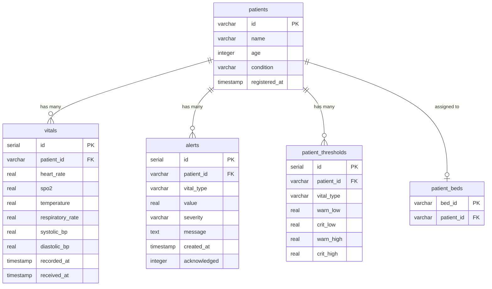

### Table Details

#### `patients`

| Column | Type | Constraints | Description |
|--------|------|-------------|-------------|
| `id` | `VARCHAR(50)` | **PRIMARY KEY** | Cerner Patient ID (e.g., "12724066") |
| `name` | `VARCHAR(255)` | `NOT NULL` | Patient full name |
| `age` | `INTEGER` | Optional | Patient age in years |
| `condition` | `VARCHAR(255)` | Optional | Primary medical condition |
| `registered_at` | `TIMESTAMP` | `DEFAULT CURRENT_TIMESTAMP` | Registration timestamp |

#### `vitals`

| Column | Type | Constraints | Description |
|--------|------|-------------|-------------|
| `id` | `SERIAL` | **PRIMARY KEY** | Auto-incrementing ID |
| `patient_id` | `VARCHAR(50)` | `NOT NULL`, FK → `patients(id)` `ON DELETE CASCADE` | Patient reference |
| `heart_rate` | `REAL` | Optional | Heart rate in bpm |
| `spo2` | `REAL` | Optional | Blood oxygen saturation (%) |
| `temperature` | `REAL` | Optional | Body temperature (°F) |
| `respiratory_rate` | `REAL` | Optional | Breaths per minute |
| `systolic_bp` | `REAL` | Optional | Systolic blood pressure (mmHg) |
| `diastolic_bp` | `REAL` | Optional | Diastolic blood pressure (mmHg) |
| `recorded_at` | `TIMESTAMP` | `NOT NULL` | When the reading was taken |
| `received_at` | `TIMESTAMP` | `DEFAULT CURRENT_TIMESTAMP` | When the server received it |

**Index:** `idx_vitals_patient_time` on `(patient_id, recorded_at DESC)` — optimizes latest-vitals lookups.

#### `alerts`

| Column | Type | Constraints | Description |
|--------|------|-------------|-------------|
| `id` | `SERIAL` | **PRIMARY KEY** | Auto-incrementing ID |
| `patient_id` | `VARCHAR(50)` | `NOT NULL`, FK → `patients(id)` `ON DELETE CASCADE` | Patient reference |
| `vital_type` | `VARCHAR(50)` | `NOT NULL` | Which vital triggered the alert |
| `value` | `REAL` | `NOT NULL` | The actual vital value |
| `severity` | `VARCHAR(20)` | `NOT NULL`, `CHECK IN ('warning', 'critical')` | Alert severity level |
| `message` | `TEXT` | Optional | Human-readable alert message |
| `created_at` | `TIMESTAMP` | `DEFAULT CURRENT_TIMESTAMP` | Alert creation time |
| `acknowledged` | `INTEGER` | `DEFAULT 0` | 0 = unacknowledged, 1 = acknowledged |

**Index:** `idx_alerts_patient` on `(patient_id, created_at DESC)`

#### `patient_thresholds`

| Column | Type | Constraints | Description |
|--------|------|-------------|-------------|
| `id` | `SERIAL` | **PRIMARY KEY** | Auto-incrementing ID |
| `patient_id` | `VARCHAR(50)` | `NOT NULL`, FK → `patients(id)` `ON DELETE CASCADE` | Patient reference |
| `vital_type` | `VARCHAR(50)` | `NOT NULL` | Vital sign name (e.g., "heart_rate") |
| `warn_low` | `REAL` | Optional | Warning low threshold |
| `crit_low` | `REAL` | Optional | Critical low threshold |
| `warn_high` | `REAL` | Optional | Warning high threshold |
| `crit_high` | `REAL` | Optional | Critical high threshold |

**Constraint:** `UNIQUE(patient_id, vital_type)` — one threshold set per vital per patient.

#### `patient_beds`

| Column | Type | Constraints | Description |
|--------|------|-------------|-------------|
| `bed_id` | `VARCHAR(50)` | **PRIMARY KEY** | Bed identifier (e.g., "BED 101") |
| `patient_id` | `VARCHAR(50)` | `UNIQUE`, FK → `patients(id)` `ON DELETE CASCADE` | Assigned patient (one patient per bed) |

### Data Lifecycle

- **Old data purge:** On startup, vitals and alerts older than 7 days are automatically deleted.
- **Legacy migration:** If the old `cerner_patient_id` column is detected, tables are dropped and recreated with the new schema.

---

## 7. Frontend Documentation

### Pages

| Page | Route | Component | Description |
|------|-------|-----------|-------------|
| Launch | `/launch` | `Launch.tsx` | SMART on FHIR handshake terminal (DEV mode) or spinner (CUS mode) |
| Callback | `/callback` | `Callback.tsx` | OAuth2 redirect handler — exchanges code for token |
| ICU Floor | `/` | `IcuFloor.tsx` | Main bed grid view showing all ICU beds with live vitals |
| Patient Monitor | `/patient/:id` | `PatientMonitor.tsx` | Individual patient dashboard with charts, ECG, insights |

### Routing

The system utilizes nested routing patterns under React Router v6. `<Shell />` acts as the main layout containing the sidebar and state status bar, rendering child pages via `<Outlet />`.

```
/ (Shell Layout)
|-- index (renders IcuFloor ICU bed grid)
|-- patient/:id (renders PatientMonitor individual dashboard)
\-- * (catch-all wildcard, redirects to / via Navigate)

/launch (top-level SMART on FHIR launch handshake page)
/callback (top-level OAuth2 authorization code callback page)
```

### State Management (Zustand)

**`vitalsStore.ts`** — Global application state:
- `vitalsHistory`: Time-capped (60 min) per-patient vitals arrays for charting.
- `latestVitals`: Most recent vital reading per patient.
- `latestEcg`: Latest ECG waveform data per patient.
- `alerts`: Rolling buffer of the 50 most recent alerts.

**`uiStore.ts`** — UI state:
- `theme`: Light/dark theme toggle (persisted to localStorage).
- `drawerOpen`: Sidebar drawer visibility.
- `alertsRailOpen`: Alerts panel visibility.
- `armedPatientId`: Patient ID selected for bed assignment.

### Hooks

**`useWebSocket.ts`** — Core real-time data hook:
- Manages WebSocket connection with auto-reconnect (3s delay).
- Seeds initial patient data from REST API on mount.
- Handles `snapshot`, `vitals`, `alert`, and `ecg` message types.
- Maintains `patients` map, `alertsMap`, and `connected` state.
- Implements connection health monitoring (15s stale detection).
- Auto-clears alerts when vitals return to normal range or patient goes offline (30s buffer).

### Components

| Component | Purpose |
|-----------|---------|
| `Shell` | App layout wrapper with sidebar and content outlet |
| `Sidebar` | Navigation panel showing patient list with live status indicators |
| `StatusBar` | Connection status, session info, token expiry countdown, and refresh button |
| `AlertsRail` | Slide-out panel displaying active alerts sorted by severity |
| `PatientDrawer` | Side panel showing patient demographics and Cerner details |
| `PatientModal` | Modal for registering new patients or searching Cerner EHR |
| `ThresholdsModal` | Modal for configuring per-patient vital sign thresholds |
| `HistoryModal` | Modal for viewing historical vitals by date and hour |
| `EcgWaveform` | Real-time ECG waveform rendered on HTML5 Canvas |
| `CopyButton` | Utility component that copies text to clipboard with animation |

### API Client (`api.ts`)

All REST API calls are centralized in `api.ts` with:
- Bearer token injection from `sessionStorage` via `getAuthHeaders()`.
- Demo mode detection via `isDemoMode()`.
- Consistent error handling with `throw new Error()`.

---

## 8. Configuration Files

### `.env.example` (Root)

The comprehensive environment template covering 7 configuration sections:

1. **Cerner FHIR R4 Base URLs** — `CERNER_BASE_URL`, `CERNER_TOKEN_URL`
2. **SMART on FHIR OAuth2 (Provider App)** — `CLIENT_ID`, `REDIRECT_URI`, `SMART_SCOPES`
3. **SMART on FHIR OAuth2 (System App)** — `SYSTEM_CLIENT_ID`, `SYSTEM_SECRET`, `SYSTEM_SCOPES`
4. **Database (NeonDB)** — `DATABASE_URL`
5. **MQTT Broker (HiveMQ)** — `MQTT_BROKER`, `MQTT_PORT`, `MQTT_USERNAME`, `MQTT_PASSWORD`
6. **Application Settings** — `ENABLE_CERNER_AUTO_SYNC`, `APP_POV`, `GROQ_API_KEY`
7. **Observability (OpenTelemetry)** — `OTEL_EXPORTER_OTLP_ENDPOINT`, `OTEL_EXPORT_*`

### `package.json` (Frontend)

- **Build:** `tsc -b && vite build`
- **Dev:** `vite` (HMR enabled)
- **Key Dependencies:** React 19, Zustand 5, Recharts 3, Framer Motion 12, React Router 7

### `requirements.txt` (Backend)

15 dependencies with inline documentation explaining each library's role.

### `vite.config.ts`

Minimal configuration using the React plugin.

### `vercel.json`

SPA deployment config with catch-all rewrite to `index.html` for client-side routing.

### `.gitignore`

Ignores: Python caches, `.env`, SQLite DBs, `node_modules`, `dist`, OS files, logs, Vercel artifacts.

### `start1.bat`

Windows batch script that launches both backend and frontend in a split Windows Terminal:
- Backend: Activates virtualenv and runs `uvicorn main:app --reload --host 0.0.0.0`
- Frontend: Runs `npm run dev -- --host`

---

## 9. Authentication

### Authentication Architecture

The system implements **two levels of authentication:**

1. **`require_auth`** — Accepts both demo tokens and real Cerner OAuth tokens. Used for basic CRUD operations that work in offline/demo mode.
2. **`require_cerner_auth`** — Requires a real Cerner OAuth token. Blocks the demo mock token. Used for Cerner-specific operations (search, import, FHIR sync).

### Login Flow (SMART on FHIR)

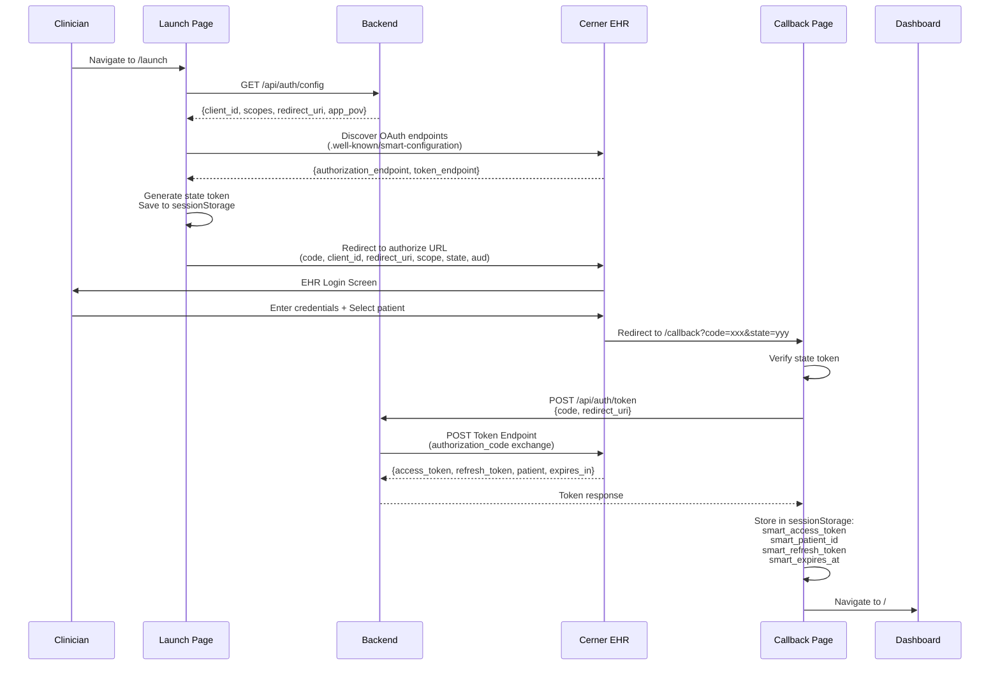

### Demo/Offline Mode

When no Cerner EHR is configured, users can access the system using a demo token (`mock_offline_demo_token`). This enables:
- Patient CRUD operations
- Bed assignments
- Threshold configuration
- Real-time MQTT monitoring

But blocks:
- Cerner patient search
- FHIR observation writes
- EHR data import

### Token Validation

Real Cerner tokens are validated by making a lightweight `GET /Patient?name=smith&_count=1` call to the Cerner FHIR server. Validated tokens are cached in memory for 60 seconds to reduce latency on subsequent requests.

### Token Refresh

The `StatusBar` component monitors token expiry and provides a manual refresh button. The backend proxies the refresh token exchange via `POST /api/auth/refresh`.

---

## 10. API Communication

### Frontend → Backend Flow

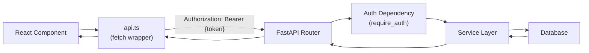

### Backend → Database Flow

1. **Thread-local connections:** Each thread gets its own PostgreSQL connection via `threading.local()`.
2. **Auto-reconnect:** On `OperationalError` or `InterfaceError`, the connection is reset and the query retried.
3. **Placeholder translation:** `?` placeholders are automatically translated to `%s` for PostgreSQL compatibility.
4. **Batched writes:** Vitals are queued in memory and flushed to the database every 10 seconds by a background daemon thread.

### Request Lifecycle

1. **Request arrives** → FastAPI middleware (CORS, OpenTelemetry auto-instrumentation)
2. **Auth check** → `require_auth` or `require_cerner_auth` dependency validates the Bearer token
3. **Business logic** → Service layer processes the request
4. **Database I/O** → Thread-local connection executes SQL
5. **Response** → JSON serialized and returned
6. **Telemetry** → Span completed, metrics updated, structured log emitted

### Middleware

- **CORS:** Allows origins `localhost:5173`, `127.0.0.1:5173`, `localhost:3000`
- **OpenTelemetry FastAPI Instrumentation:** Auto-creates HTTP spans for GET/POST requests (excludes WebSocket)
- **OpenTelemetry Requests Instrumentation:** Auto-traces outgoing HTTP calls
- **OpenTelemetry Logging Instrumentation:** Bridges Python logging to OTel

---

## 11. Installation Guide

### Prerequisites

| Tool | Minimum Version | Purpose |
|------|----------------|---------|
| Python | 3.11+ | Backend runtime |
| Node.js | 18+ | Frontend runtime |
| npm | 9+ | Frontend package manager |
| Git | 2.x | Version control |

### Step 1: Clone the Repository

```bash
git clone https://github.com/rohith1612/rpm-system-v2.git
cd rpm-system-v2
```

### Step 2: Backend Setup

```bash
# Create virtual environment
python -m venv venv

# Activate virtual environment
# Windows:
venv\Scripts\activate
# macOS/Linux:
source venv/bin/activate

# Install dependencies
pip install -r backend/requirements.txt
```

### Step 3: Frontend Setup

```bash
cd frontend
npm install
cd ..
```

### Step 4: Environment Variables

```bash
# Copy the template
cp .env.example .env

# Edit .env and fill in your actual values:
# - DATABASE_URL (NeonDB connection string)
# - MQTT_BROKER, MQTT_PORT, MQTT_USERNAME, MQTT_PASSWORD (HiveMQ Cloud)
# - CERNER_BASE_URL, CERNER_TOKEN_URL, CLIENT_ID (Cerner Code Console)
# - SYSTEM_CLIENT_ID, SYSTEM_SECRET (Cerner System App)
# - GROQ_API_KEY (Groq Console)
```

### Step 5: Database Setup

The database tables are **automatically created** on backend startup. No manual migration is needed for a fresh deployment.

For migrating from a legacy SQLite database:
```bash
cd backend
python migrate_to_neon.py
```

### Step 6: Running the Application

**Option A: Using the batch script (Windows)**
```bash
start1.bat
```

**Option B: Manual startup**

Terminal 1 (Backend):
```bash
cd backend
uvicorn main:app --reload --host 0.0.0.0
```

Terminal 2 (Frontend):
```bash
cd frontend
npm run dev -- --host
```

### Step 7: Access the Application

- **Frontend:** http://localhost:5173
- **Backend API:** http://localhost:8000
- **Swagger Docs:** http://localhost:8000/docs

### Common Errors & Troubleshooting

| Error | Cause | Solution |
|-------|-------|----------|
| `DATABASE_URL is not set` | Missing `.env` configuration | Copy `.env.example` to `.env` and fill in `DATABASE_URL` |
| `MQTT connection refused` | Invalid broker credentials | Verify `MQTT_BROKER`, `MQTT_USERNAME`, `MQTT_PASSWORD` in `.env` |
| `Token exchange failed` | Invalid Cerner credentials | Verify `CLIENT_ID` and `REDIRECT_URI` match Cerner Code Console |
| `psycopg2.OperationalError` | NeonDB connection timeout | Check `DATABASE_URL` format and network connectivity |
| `CORS error in browser` | Frontend URL not in CORS list | Add the frontend URL to `CORS_ORIGINS` in `config.py` |

---

## 12. Deployment Guide

### Local Development

See [Installation Guide](#11-installation-guide) above.

### Frontend Deployment (Vercel)

The frontend includes a `vercel.json` configuration:

```json
{
  "framework": "vite",
  "buildCommand": "npm run build",
  "outputDirectory": "dist",
  "rewrites": [{ "source": "/(.*)", "destination": "/index.html" }]
}
```

**Steps:**
1. Install Vercel CLI: `npm i -g vercel`
2. Deploy: `cd frontend && vercel --prod`
3. Set environment variables in Vercel dashboard:
   - `VITE_API_BASE` — Backend API URL
   - `VITE_WS_URL` — Backend WebSocket URL

### Backend Deployment

The FastAPI backend can be deployed on any ASGI-compatible platform:

1. **Railway / Render:** Push to GitHub, connect repo, set env vars, deploy.
2. **Docker:** Create a `Dockerfile` with `uvicorn main:app --host 0.0.0.0 --port 8000`.
3. **Cloud VMs:** Run behind Nginx reverse proxy with SSL termination.

### Environment Variables for Production

All sensitive values must be set as environment variables (never hardcoded):
- `DATABASE_URL` — NeonDB connection string with `sslmode=require`
- `MQTT_BROKER`, `MQTT_USERNAME`, `MQTT_PASSWORD` — HiveMQ Cloud credentials
- `CERNER_BASE_URL`, `CLIENT_ID`, `SYSTEM_CLIENT_ID`, `SYSTEM_SECRET` — Cerner OAuth
- `GROQ_API_KEY` — AI service key
- `OTEL_EXPORT_*_TO_OTLP=true` — Enable OTLP export for Grafana

---

## 13. Security

### Input Validation

- **Pydantic models** validate all request bodies (`PatientCreateUpdate`, `ThresholdUpdate`, `CernerSyncRequest`, etc.).
- **Query parameter validation** via FastAPI `Query()` with `ge`, `le`, `description` constraints.
- **SQL parameterization** — all queries use parameterized placeholders (`?` / `%s`), preventing SQL injection.

### Password Security

- No local passwords are stored — authentication is delegated to Cerner EHR via OAuth2.
- System credentials (`SYSTEM_SECRET`) are stored only in environment variables, never in code.

### JWT / Token Security

- Access tokens are stored in `sessionStorage` (cleared on tab close, immune to XSS from other tabs).
- Token validation uses a lightweight FHIR API probe with 60-second in-memory caching.
- Token refresh is proxied through the backend to avoid exposing the token endpoint to CORS.

### CORS

Configured with an explicit allowlist:
```python
CORS_ORIGINS = [
    "http://localhost:5173",
    "http://127.0.0.1:5173",
    "http://localhost:3000",
]
```

### PII Redaction

The telemetry layer implements automatic PII redaction:
- **Patient IDs** are partially redacted (show last 4 characters only) in all logs.
- **Phone numbers** are masked using regex pattern matching.
- **Email addresses** have the username portion replaced with asterisks.
- **Sensitive dictionary keys** (patient_id, name, dob, ssn, address, etc.) are auto-detected and redacted.

### Environment Variables

- `.env` files are excluded from version control via `.gitignore`.
- `.env.example` provides a template without actual credentials.
- All secrets use `os.environ.get()` with safe defaults.

### TLS/SSL

- MQTT connections use TLS on port 8883 (HiveMQ Cloud).
- NeonDB connections use `sslmode=require`.
- Cerner FHIR API calls use HTTPS.

---

## 14. Code Explanation

### Key Architectural Decisions

#### In-Memory Vitals Cache + Batched DB Writes

The `vitals_service.py` implements a **write-behind cache pattern**:
- Incoming vitals are immediately stored in `latest_vitals_cache` (dict) for instant API retrieval.
- They are also queued in `vitals_queue` (thread-safe `queue.Queue`).
- A background daemon thread (`db_flush_worker`) drains the queue every 10 seconds and performs batched inserts.
- **Congestion control:** Within each batch, only the latest reading per patient is kept (downsampling).

This design ensures sub-second API response times while preventing database overload from high-frequency MQTT telemetry.

#### Dual MQTT Clients

The system uses **two separate MQTT clients** on independent threads:
- **Vitals client:** Subscribes to `rpm/{session}/+/vitals`
- **ECG client:** Subscribes to `rpm/{session}/+/ecg`

This separation prevents high-frequency ECG data (50Hz) from blocking vital signs processing.

#### Leaky Bucket Queue (Cerner Sync)

The `cerner_queue.py` implements a **leaky bucket** pattern for rate-limiting FHIR writes:
- Vitals are split into individual LOINC-coded observations and enqueued.
- A worker thread processes one item every 2 seconds.
- Failed writes are retried up to 3 times, then re-queued with reset retry count.
- Temperature values are automatically converted from Celsius to Fahrenheit.

#### Thread-Local Database Connections

Each thread gets its own PostgreSQL connection via `threading.local()`, avoiding connection contention between the main FastAPI thread, MQTT threads, and the DB flush worker thread.

---

## 15. Project Workflow

### Login Workflow

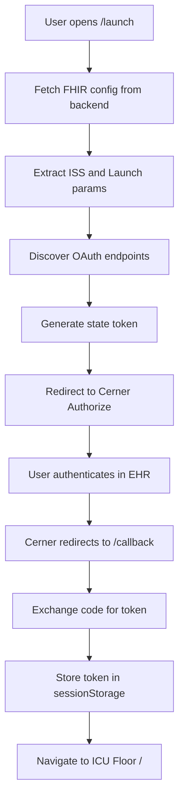

### CRUD Operations — Create Patient

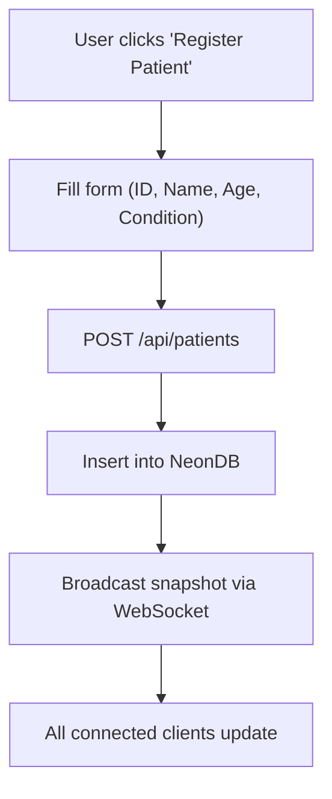

### Vital Signs Processing Pipeline

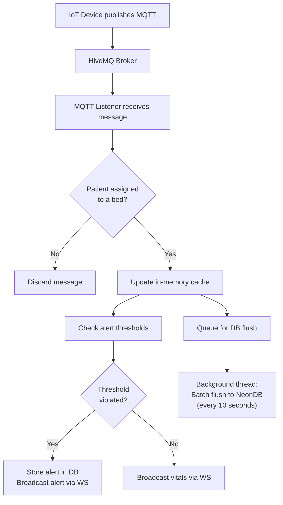

---

## 16. Sequence Diagrams

### User Login

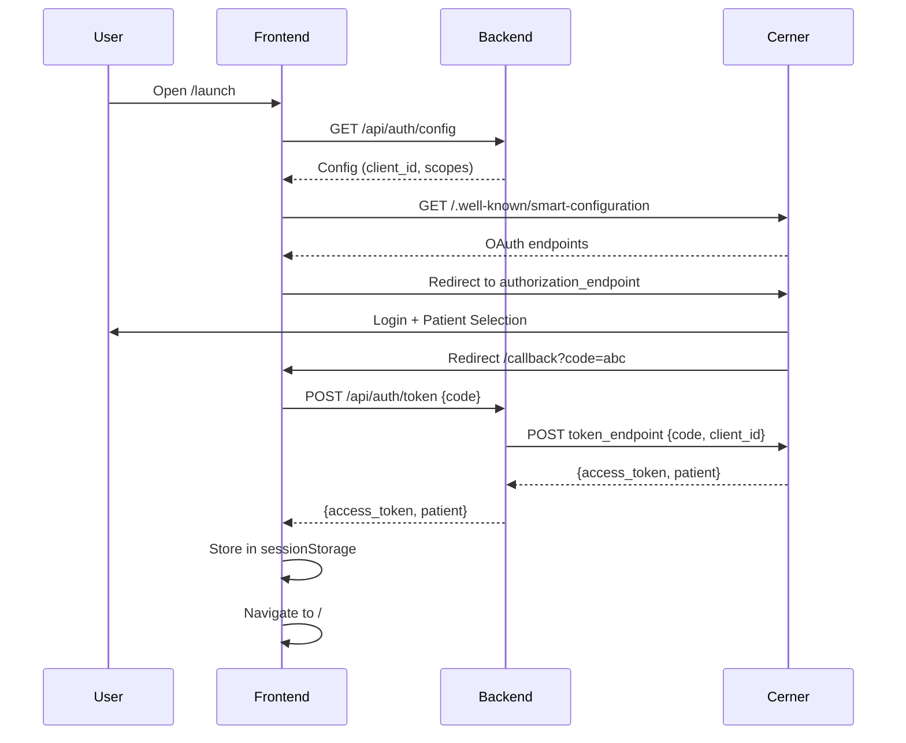

### Create Patient Record

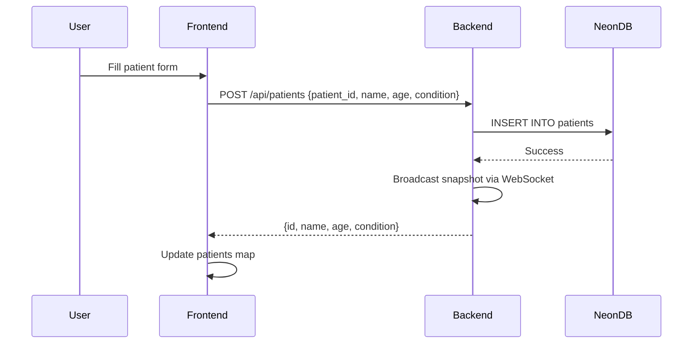

### Fetch Vitals History

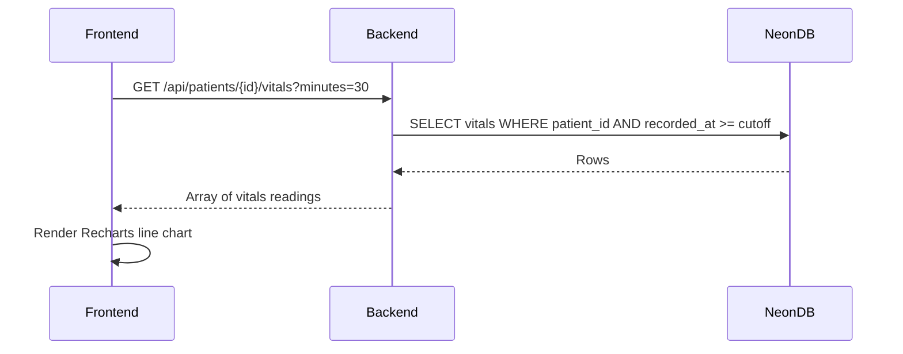

### Sync Vitals to Cerner

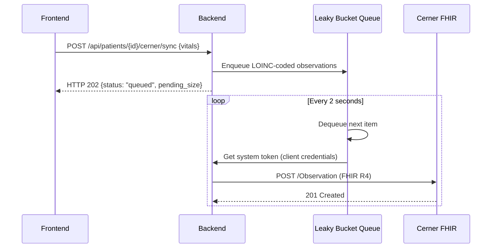

### Delete Patient

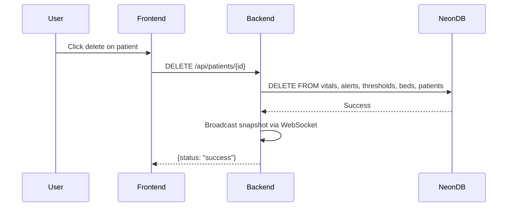

---

## 17. Flowcharts

### Application Startup

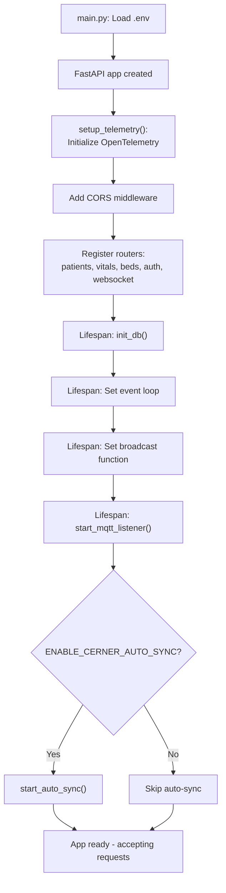

### Database Connection Flow

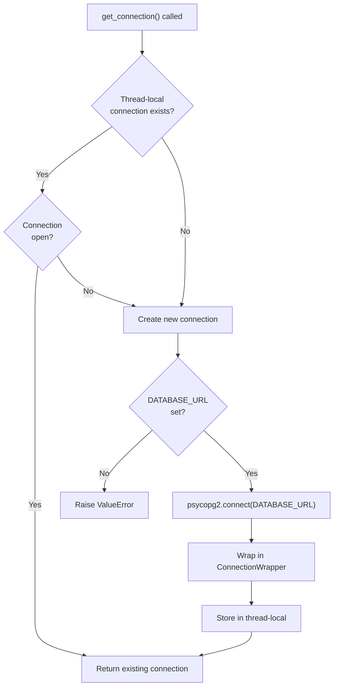

### API Request Lifecycle

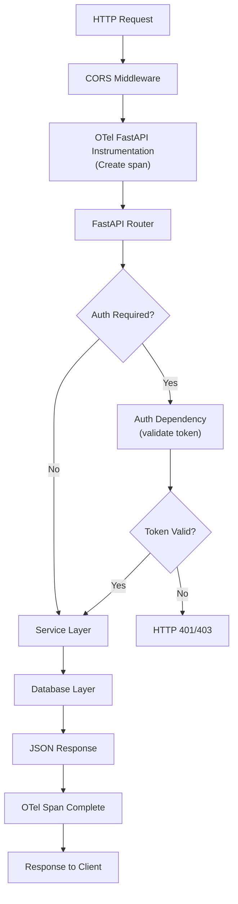

---

## 18. Error Handling

### Validation Errors

- **Pydantic** automatically validates request bodies and returns `422 Unprocessable Entity` with detailed field-level error messages.
- **Query parameters** are validated by FastAPI's `Query()` with `ge`/`le` constraints.

### HTTP Errors

| Code | Meaning | Usage |
|------|---------|-------|
| `200` | OK | Successful response |
| `400` | Bad Request | Duplicate patient ID, invalid input |
| `401` | Unauthorized | Missing or invalid token |
| `403` | Forbidden | Demo token used on Cerner-gated endpoint |
| `404` | Not Found | Patient not found |
| `502` | Bad Gateway | Cerner token endpoint unreachable |

### Database Errors

- `psycopg2.OperationalError` / `psycopg2.InterfaceError` → Auto-reconnect and retry.
- Other exceptions → Rollback transaction, re-raise.
- Failed vitals batch flushes → Items re-queued for next flush cycle.

### Authentication Errors

- Missing token → `401 Unauthorized` with `WWW-Authenticate: Bearer` header.
- Invalid/expired token → `401 Unauthorized`.
- Demo token on Cerner endpoint → `403 Forbidden`.

### Logging Strategy

All errors are logged using the structured `log_event()` helper with:
- `event_category` (e.g., "auth", "neondb", "cerner_write")
- `event_type` (e.g., "token_validation_failure", "connection_reset")
- `outcome` ("success", "failure", "pending")
- `error_detail` (exception message, automatically PII-redacted)
- `duration_ms` (for latency tracking)
- OpenTelemetry `trace_id` / `span_id` correlation

### Recovery Strategy

| Component | Failure | Recovery |
|-----------|---------|----------|
| Database connection | Connection dropped | Auto-reconnect on next query |
| MQTT broker | Connection lost | `loop_forever()` auto-reconnects |
| WebSocket | Client disconnect | Client auto-reconnects after 3s |
| Cerner FHIR write | HTTP error | Retry 3x, then re-queue |
| Vitals DB flush | Exception | Items re-queued for next cycle |

---

## 19. Performance Analysis

### Optimization Techniques

1. **In-Memory Vitals Cache:** Latest vitals per patient stored in a Python dict for O(1) lookup, avoiding DB queries for real-time data.
2. **Batched Database Writes:** Vitals are written in batches every 10 seconds instead of per-message, reducing DB connection overhead by ~10x.
3. **Congestion Control / Downsampling:** Within each batch, only the latest reading per patient is kept, preventing DB bloat during high-frequency telemetry.
4. **Token Caching:** Validated Cerner tokens are cached for 60 seconds, eliminating redundant validation calls.
5. **Active Patient Caching:** Bed assignments are cached for 5 seconds to avoid DB hits on every MQTT message.
6. **ECG Memory Management:** ECG buffer is capped at 500 samples (~10 seconds at 50Hz) to prevent memory leaks.
7. **Time-Based Vitals Store:** Frontend vitals history uses a 60-minute time-based cutoff instead of count-based, ensuring consistent chart coverage.

### Database Optimization

- **Indexes:** `idx_vitals_patient_time` enables fast `ORDER BY recorded_at DESC LIMIT 1` queries per patient.
- **Hourly aggregation:** Uses PostgreSQL `AVG()` + `GROUP BY to_char()` for efficient 1-minute rollups.
- **Data purge:** Records older than 7 days are deleted on startup.

### Scalability

- **Horizontal:** Multiple backend instances can share the same NeonDB and MQTT broker.
- **Vertical:** In-memory caches scale with available RAM.
- **MQTT:** Dual-client architecture separates vitals (low frequency) from ECG (high frequency) processing.

---

## 20. Testing

### Automated Tests

> [!NOTE]
> No automated test suite (unit tests, integration tests) was found in the codebase. The project currently relies on manual testing.

### Manual Testing

| Test Case | Steps | Expected Outcome |
|-----------|-------|------------------|
| Demo mode login | Open app → ICU Floor loads without auth | All CRUD operations work with mock token |
| Cerner OAuth login | Click "Login with Cerner" → Complete EHR auth | Token stored, Cerner features enabled |
| Patient registration | Click "Register" → Fill form → Submit | Patient appears in bed grid and DB |
| Bed assignment | Select patient → Click empty bed | Patient mapped to bed, vitals display |
| Live vitals | Start MQTT simulator | Real-time values update on dashboard |
| Alert generation | Send vitals exceeding thresholds | Alert appears in rail and broadcasts |
| AI insights | Open patient → Click "AI Insights" | Markdown clinical analysis returned |
| Cerner sync | Click "Sync to Cerner" | Vitals queued and written to FHIR server |
| Historical view | Open history modal → Select date/hour | Aggregated chart displays |
| WebSocket reconnect | Stop/start backend | Frontend reconnects within 3 seconds |

### Edge Cases

- Patient with no vitals data requesting AI insights → Returns "Not enough data" error.
- Duplicate patient ID creation → Returns 400 error.
- Expired Cerner token → Returns 401, frontend shows refresh button.
- Database connection drop during flush → Items re-queued, connection auto-recovers.
- High-frequency MQTT messages → Congestion control downsamples to 1 per patient per batch.

---

## 21. Future Enhancements

### Feature Improvements

- **Mobile-responsive PWA** — Progressive Web App for tablet/mobile ICU rounds.
- **Audio/visual alarm system** — Browser notifications and sound alerts for critical events.
- **Multi-patient ECG comparison** — Side-by-side ECG waveform viewing.
- **Patient transfer workflow** — Bed-to-bed transfer with history preservation.
- **Clinical notes** — Free-text note attachment per patient encounter.

### Performance Improvements

- **Connection pooling** — Replace thread-local connections with `psycopg2.pool.ThreadedConnectionPool`.
- **Redis caching** — Move in-memory caches to Redis for multi-instance deployments.
- **WebSocket compression** — Enable per-message deflate for bandwidth reduction.
- **Database partitioning** — Partition vitals table by month for improved query performance.

### Security Improvements

- **PKCE (Proof Key for Code Exchange)** — Add PKCE to the OAuth2 flow for enhanced security.
- **Rate limiting** — Add API rate limiting middleware (e.g., slowapi).
- **Audit logging** — Log all data access events for HIPAA compliance.
- **Role-based access control (RBAC)** — Differentiate nurse, doctor, and admin permissions.

### UI Improvements

- **Dark/light theme polish** — Enhanced theming with system preference detection.
- **Accessibility (a11y)** — WCAG 2.1 AA compliance for screen readers and keyboard navigation.
- **Drag-and-drop bed assignment** — Visual drag-and-drop patient-to-bed workflow.
- **Internationalization (i18n)** — Multi-language support.

### Scalability Improvements

- **Kubernetes deployment** — Container orchestration for auto-scaling.
- **Event-driven architecture** — Replace polling with event streams (Kafka/NATS).
- **Multi-tenant support** — Isolate data per hospital organization.
- **HL7v2 ADT integration** — Automatic patient admission/discharge/transfer sync.

---

## 22. Project Summary

### Executive Summary

The Remote Patient Monitoring (RPM) System is a full-stack, production-oriented healthcare application that bridges IoT medical devices with the Cerner EHR ecosystem. It provides real-time vital signs monitoring via an MQTT → WebSocket pipeline, threshold-based clinical alerting, AI-powered clinical insights, and bidirectional FHIR R4 data exchange — all wrapped in a modern React dashboard with enterprise-grade OpenTelemetry observability.

### Achievements

1. **End-to-end real-time pipeline** — Sub-second latency from IoT device to browser dashboard.
2. **SMART on FHIR integration** — Full OAuth2 authorization code flow with Cerner EHR Sandbox.
3. **Bidirectional FHIR R4** — Read patient demographics and write LOINC-coded observations.
4. **AI clinical intelligence** — Context-aware medical insights using Groq/Llama 3.3 70B.
5. **Enterprise observability** — Structured JSON logs, distributed traces, and process metrics exportable to Grafana.
6. **PII-safe telemetry** — Automatic redaction of patient identifiers, emails, and phone numbers in all logs.
7. **Offline/demo mode** — Full functionality without Cerner EHR for development and demonstration.

### Challenges

1. **Cerner Sandbox limitations** — Rate limits and sandbox data constraints required the leaky bucket queue pattern.
2. **MQTT thread synchronization** — Bridging MQTT callback threads to the async FastAPI event loop required careful `asyncio.run_coroutine_threadsafe()` usage.
3. **Real-time data consistency** — Merging in-memory cache with database state required careful cache invalidation.
4. **FHIR compliance** — Mapping local vitals to correct LOINC codes and UCUM units for Cerner acceptance.

### Lessons Learned

1. **Write-behind caching** dramatically improves real-time system responsiveness.
2. **Leaky bucket queues** are essential when integrating with rate-limited external APIs.
3. **Structured logging** with correlation IDs (trace_id/span_id) makes debugging distributed systems feasible.
4. **SMART on FHIR** requires careful endpoint discovery and persona-specific authorization flows.
5. **PII redaction** must be baked into the logging layer, not bolted on later.

### Future Scope

The platform is designed to evolve into a production-grade clinical monitoring system with:
- Multi-hospital, multi-tenant deployment on Kubernetes
- HL7v2 ADT integration for automated patient admission workflows
- FDA-class medical device connectivity via standardized protocols
- Clinical decision support (CDS) hooks for automated order suggestions
- HIPAA-compliant audit trail and access control

### Conclusion

The RPM System successfully demonstrates the feasibility of building a modern, integrated healthcare monitoring platform that combines IoT telemetry ingestion, real-time data streaming, EHR interoperability, and AI-assisted clinical analysis. The architecture is modular, observable, and designed for incremental enhancement toward production clinical deployment.

---

> **Document generated from source code analysis of the `rpm-system-v2` repository.**
> All information is derived from actual codebase inspection — no assumptions were made.
